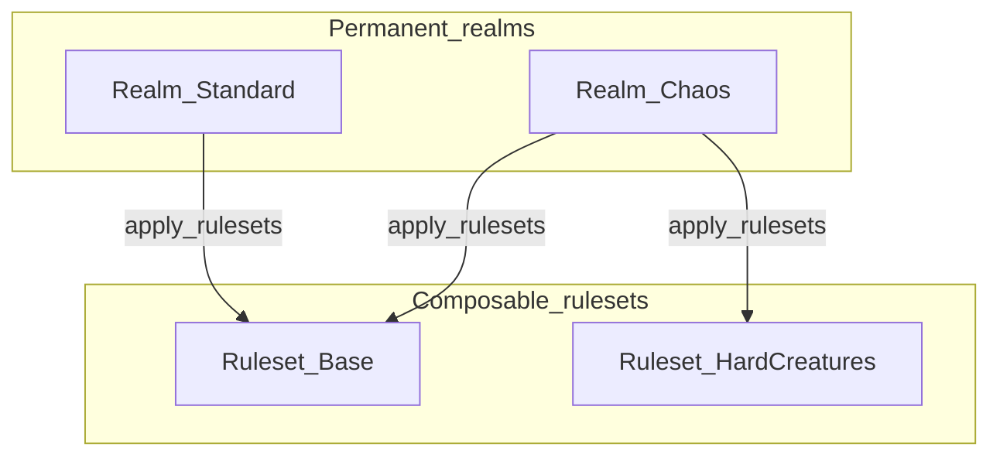

# AGENTS.md — ace-raaj-mods

## 1. Mandatory Skills
Before any work, load applicable skills:
- **ace-mod** — REQUIRED for all C#, Harmony, weenie, or database work.
- **using-superpowers** — Load before ANY action; if a skill might apply (even 1%), load it.
- **planning-with-files** — REQUIRED for all multi-phase or complex tasks (3+ steps). Before execution, create `task_plan.md`, `findings.md`, and `progress.md` in the project directory and update them after each phase.
- **Local skill override** — This repo contains a team-specific skill at `.cursor/skills/ace-mod-team/SKILL.md` that extends the global `ace-mod` skill with project-specific patterns. When the global `ace-mod` skill is invoked, also read the local override.

## 2. Starting Workflow
**Git (each new chat, before substantive work):** From repo root `A:/ai/projects/ace-raaj-mods`, run `git status -sb`. If dirty, note `M` / `??` paths briefly so unstaged and untracked work is not forgotten. Repeat before handoff when edits were made.

Always check in this order:
1. **`PLAN.md`** — **Active** work only: bug tracker, immediate reworks, suggested implementation order, greenfield backlog, short `## Progress (recent)` pointers. **Do not** let PLAN grow into a duplicate shipped-history log.
2. **`COMPLETED.md`** — **Shipped** milestones and retrospectives, **one dated section per ship day** (`## YYYY-MM-DD`). Canonical “what already landed.” For history or changelog detail, read here—not a bloated PLAN.
3. **Ship workflow:** When work is verified and committed, **append `COMPLETED.md`** (dated subsection with enough detail for future you), then **trim `PLAN.md`** (remove matching “Done” bullets from Progress, collapse long shipped sections, keep PLAN scannable).
4. `README.md` — Mod list, enablement status.
5. Mod-specific `Readme.md` — Per-mod docs and configuration notes.
6. **Skills** — Load domain-specific skills before touching code.
7. **Game mechanics / vanilla ACE behavior** — Follow **§7.0** (wiki first, then live tree, then `.references/`, then graphify/rg). Do not invent behavior from memory.

## 3. Repo Conventions
- **Mod structure:** Each folder = deployable mod containing:
  - `Meta.json` — Enable/disable, hot-reload, version. **Do not change `Enabled` without user direction.**
  - `Settings.cs` — C# defaults. Use `JsonPropertyName("// ...")` doc band + values band pattern.
  - `Settings.json` (in repo) — **Template / shared defaults** for new installs, CI, and docs. Safe to edit for **new keys** and documented example values—not assumed to match what Windblown test is tuned to.
  - `*.csproj` — Builds to `C:\ACE\Mods\$(AssemblyName)` locally.

**Test ACE `Settings.json` (operator source of truth — `C:\ACE\Mods\<AssemblyName>\Settings.json`):** The **installed** file on **`C:\ACE\`** is the **canonical balance and preference** snapshot for test. Agents and humans should treat it as **immutable** in the sense: **do not overwrite it** with the repo copy on deploy unless the operator explicitly wants a reset. When adding a feature with **new** JSON keys: update **`Settings.cs`** + repo **`Settings.json`** (defaults + doc band), **and** merge those keys into the test file (or edit test directly while iterating)—then backfill repo defaults from agreed-on values if you want shipped defaults to match post-balance. **`push test`** (§8.1): deploy DLL/Meta; **preserve** test `Settings.json` by default.
- **Harmony patches:** Prefer `nameof` targeting. Prefix patch methods with `Pre`/`Post`/`Transpiler`. Use `PatchCategory` for grouped unpatch.
- **Cross-mod properties:** Check shared IDs before inventing new ones:

| Property | Meaning | Used By |
|----------|---------|---------|
| `FakeFloat 11012` | EnlightenmentPoolBonus | AureatePath / Loremaster / ChallengeModes |
| `FakeInt 40113` | BuddySpawn tag | Swarmed |
| `FakeInt 10029` | CreatureExType | Swarmed |
| `FakeBool 40100` | GrowthItem | EmpyreanAlteration |
| `FakeBool 40130` | IsAwakened | EmpyreanAlteration |
| `FakeInt 40131` | AwakenedTier | EmpyreanAlteration |
| `FakeInt 40132` | PreImbuedCount | EmpyreanAlteration |
| `FakeInt 40133` | Overtinked custom imbue bitmask (Hemorrhage/Cleaving/Nether/Shatter on item) | Overtinked |
| `FakeInt 40134` | Shatter debuff stack count on creature | Overtinked |
| `FakeInt 40135` | Shatter broken (max stacks) on creature | Overtinked |
| `FakeString 11033` | OriginalName | EmpyreanAlteration |
| `FakeString 11034` | ProfileName | EmpyreanAlteration |
| `FakeBool 12001` | Event announcement opt-out | WorldEvents |
| `FakeBool 12002` | **Legacy** periodic auto-claim flag (pre-json); migrated to `Mods/WorldEvents/PendingClaimsAuto/<guid>.json` on login/tick — do not reuse for new features | WorldEvents |

**Windblown custom trophies (physical stackables):** When adding tiered quest trophies that should **autoloot to the pack** as real items (not LLL ledger rows), follow **`WindblownContent/docs/Windblown-Custom-Trophy-Settings.md`** — WCID checklist, AutoLoot Pass 1 (`UpgradedTrophyWeenieClassIds`), QOL bulk turn-in, BSS drops/turn-in, SQL template. Extend that doc with each new line.

## 4. Agent Permissions
- **DO:** Edit repo `Settings.json` for templates/new keys; tune **test** `C:\ACE\Mods\<Mod>\Settings.json` for balance (that file is operator truth—see §3). Fix bugs, refactor for clarity.
- **DO:** Apply SQL you add or change under mod `Content/SQL/` (or equivalent) to the target MySQL database yourself—**test `ace_world`** by default—using the repo’s MySQL credentials, then verify with `SELECT`. Do not leave “run this manually” as the only step unless the user forbids DB writes.
- **DO:** **Back up before SQL that adds or mutates world/shard data** — `mysqldump` (scoped to the rows/tables you will touch) into `WindblownContent/sql-backups/YYYY-MM-DD/` before `mysql ... <` applies the change. Same for live `wb_*` when the user authorizes it. See §8.7.
- **DO:** Commit and push after every bug fix or problem solved. Never accumulate uncommitted fixes.
- **DO NOT:** Change `Meta.json` enablement without explicit user direction.
- **DO NOT:** Create new mods without confirming scope.
- **DO NOT:** Use, reference, modify, or deploy `ValheelContent` for any reason unless specifically asked by the user.
- **DEPLOYMENT WORKFLOW:** **ALWAYS deploy to test server (`C:\ACE\`) first.** Never push directly to live (`C:\ACE-WB\`) unless user explicitly says "push live". Test → Verify → Then request permission.

## 5. Build & Deploy
- Build locally via `dotnet build` in each mod folder (outputs to `C:\ACE\Mods\`).
- Release zips auto-generated by `.csproj` `ZipOutputPath` target in Release config.
- GitHub Actions workflow handles CI builds and releases.

## 6. Releases & Changelogs
- **Every push** to GitHub must include a clear changelog.
- Update `README.md` feature list when adding/changing significant functionality.
- Hand-written summaries for user-facing changes are strongly preferred.

## 7. External Paths (Always Allowed)

### 7.0 Game mechanics: ACE / ACRealms source lookup

**Primary source of truth for “how does the game work?” questions:** the wiki hub **`A:\obsidian\jeremy\wiki\game-engine\ACE-Realms-Source-Map.md`** (Obsidian: `[[ACE-Realms-Source-Map]]`). It links topic pages (WorldObject, Player commerce/use, Creature combat, RecipeManager, Vendor/Emotes/Quests, Landblock/Realms, loot, spells) with start files and grep seeds.

**Order of evidence:**

1. **Wiki** — curated paths and traps; extend topic pages when you discover new behavior.
2. **Live fork** — `C:\ACE-REALMS\Source\` (layout follows upstream; `ACE.Server` project under `Source\`) for the code that **actually runs** on your instance.
3. **Pinned snapshots** — `ace-raaj-mods/.references/` (e.g. `ACRealms.WorldServer-2.1.4\Source\`) for **stable line citations** and agents without the live drive.
4. **graphify / ripgrep** — §10 graphify for **this repo’s mods**; for upstream **ACE.Server** AST overview see `A:\obsidian\jeremy\raw\graphify-out-ace-realms\GRAPH_REPORT.md` when present. Use targeted `rg` on `ACE.Server` for symbols/strings.

- **`A:\`** — Full drive access for research, data mining, configuration, code analysis, deployment.
- **`C:\ACE\`** — Test server installation (port 9000). Use when **"push test"** or comparing against a non-Realms tree; keep **`$(ACEPath)`** on mod projects pointed at the **`ACE.Server.dll`** you actually run here.
- **`C:\ACE-REALMS`** — **ACRealms** fork (Windblown primary upstream target). Clone/build: [ACRealms/ACRealmsForkMirror](https://github.com/ACRealms/ACRealmsForkMirror) (mirror for visibility/diffs); narrative “main” repo: [ACRealms/ACRealms.WorldServer](https://github.com/ACRealms/ACRealms.WorldServer) — **some doc links still land on WorldServer**; treat mirror + WorldServer as paired sources of truth. **Build:** `cd C:\ACE-REALMS\Source` then `dotnet restore ACRealms.sln` and `dotnet build ACRealms.sln -c Release` (TFM follows branch; `master` has used **net9.0** with output under `Source\ACE.Server\bin\x64\Release\net9.0\`). **First run:** copy `Config.js.example` → `Config.js`, `Config.realms.js.example` → `Config.realms.js`; pick a **Port** at least **2** away from `C:\ACE` (9000) and `C:\ACE-WB` (9002). Operator DB/migration notes: [Docs/setup-tips.md](https://github.com/ACRealms/ACRealmsForkMirror/blob/master/Docs/setup-tips.md). When ACRealms is canonical, aim mod **`$(ACEPath)`** at the same DLL set this server loads (avoid mixing vanilla ACE `ACE.Server.dll` with Realms-shaped mods).
- **`C:\ACE-WB\`** — Live Windblown server (port 9002). **Never deploy here without explicit "push live".** When a mod ships **`Content/SQL/`** weenie or recipe changes, apply the **same scripts to `wb_ace_world`** (and `wb_ace_shard` if biota cleanup is documented) after copying DLLs — otherwise live can show wrong **ItemUseable** / examine text while test `ace_world` looks correct.
- **`A:\ai\projects\ace-sql`** — External ACE SQL content repository.
- **`A:\obsidian\jeremy\wiki\*`** — Persistent knowledge wiki; read and edit freely.
- **`B:\Backup\ac custom stuff`** — Stockpile of raw AC custom content (weenies, landblocks, dungeons, spells). See `_INDEX.md`.
- **`B:\Backup\ac custom stuff\_DB_BACKUPS\`** — ValHeel server MySQL dumps.
- **`B:\Backup\ac custom stuff\reference\`** — Mod frameworks preserved for reference.
- **`.references/`** — ACE source/server files, ACRealms, world database dumps. Check this directory when investigating ACE internals.

### ACRealms operator snapshot (`C:\ACE-REALMS\Server\Config.js`)

**Values from the live file (keep in sync when you change ops):** `Server.WorldName` **Dust**; **`Network.Port` 9004** (server binds **9004 and 9005**). **MySQL** `127.0.0.1:3306` — **`dust_ace_auth`**, **`dust_ace_shard`**, **`dust_ace_world`**. **Paths:** `DatFilesDirectory` `c:\ACE-REALMS\Dats\`; `ModsDirectory` `c:\ACE-REALMS\Mods\`. **Offline / DB automation:** `AutoApplyDatabaseUpdates`, `AutoUpdateWorldDatabase`, `AutoApplyWorldCustomizations` are enabled there—know that before hand-applying conflicting SQL. **Do not** paste DB passwords into repo docs; use `Config.js` on the host (same local MySQL user pattern as §8.7 when unchanged). **User trigger for this log:** say **`check logs dust`** (see §8.1).

### ACRealms — realms, rulesets, and what JSON can (and cannot) do

**Mission (from upstream README):** ACRealms targets servers with **heavy customization**: **instanced landblocks**, **ruleset composition**, **ephemeral realms** (temporary rules layered on landblocks—think “map device” style), and **automated tests**. Branch policy upstream: **`master`** = latest dev; **`v2.1`** = beta balance; **`v2.0`** = most stable even branch—back up databases before upgrades.

| Concept | Meaning |
|--------|---------|
| **Realm** (`"type": "Realm"` in JSONC) | A **persistent world** players can attach to. May be a **homeworld** (`CanBeHomeworld`, neutral zone, hideout, PK rules, recalls, classical instances, etc.). |
| **Ruleset** (`"type": "Ruleset"`) | **Not** a homeworld. A **bag of composed `RealmProperty*` values** layered on a realm (or other rulesets) via `parent`, `apply_rulesets`, `apply_rulesets_random`. |
| **Composition** | `parent` inherits; `apply_rulesets` runs in order; `apply_rulesets_random` picks weighted or nested-random rulesets (see upstream `Content/json/realms/ruleset/random-test.jsonc` on WorldServer). Per-property entries support `value`, `low`/`high`, `reroll` (`landblock` / `always` / `never`), `compose` (`add` / `multiply` / `replace`), `locked`, `probability`. |
| **`realms.jsonc`** | **Auto-generated** (per upstream README, May 2024+). Realm **IDs** must stay stable after first run; do not invent ad-hoc ID churn. |

**Where to edit:** `Content/json/realms/realm/*.jsonc` and `Content/json/realms/ruleset/*.jsonc`. Use **VS Code with `Content/` as workspace root**; after a successful **ACE.Server** build, **generated JSON schema** under `Content/json-schema/` drives autocomplete for property keys.

**Examples you can ship with data alone:**
1. **Two homeworlds** — e.g. a “standard” realm and a “chaos” realm, both `CanBeHomeworld: true`, sharing a base ruleset via `parent` / `apply_rulesets`, with the chaos realm adding a second ruleset that raises creature tuning floats.
2. **Ephemeral / stamped rulesets** — `RealmPropertyInt.RulesetStampVendorCategory` ties vendor stamps to rulesets players can apply in instanced content (see enum descriptions in upstream `RealmPropertyInt.cs`).
3. **Randomized dungeon feel** — `apply_rulesets_random` + `properties_random_count` for weighted rolls at landblock load.



**“Chaos realm” = higher aggro + adds on kill?** Under **one** `ACE.Server` process you **can** run **multiple realms** with **different composed rulesets**—that is the core model. **Creature stat / HP pressure** is partly covered today: upstream code reads ruleset floats such as **`CreatureSpawnHPMultiplier`** and attribute multipliers when spawning/scaling creatures (see `ACE.Server` `Creature.cs` + `RealmPropertyFloat.cs` in `.references/ACRealms.WorldServer-*` or your `C:\ACE-REALMS` tree). **PK, recalls, spell windup/angle caps, landblock unload interval, classical instances**, and many bools are also ruleset-driven via `RealmRuleset.GetProperty(...)`.

**Not covered as `RealmProperty*` today (v2.1-era enums in `.references/`):** per-realm **aggro / awareness radius** knobs and a generic **“extra adds on death”** probability are **not** exposed as composed realm properties—those remain **weenie/treasure/emote + server logic**, or a **Harmony mod** that branches on **`player.RealmRuleset` / landblock realm** (README: *“many features not implemented as a realm property”*). To get exactly your vision, plan either **realm-aware mods** or **contributing new `RealmProperty*` + engine reads** upstream.

**Known limitations (README):** **Landblock static content is global** across realms until upstream per-realm landblock work lands (README cites **v2.3** milestone). **Ruleset JSON hot-reload** is not reliable—expect **restart** when iterating realms/rulesets.

**Reserved ID ranges (do not collide in custom content):** `PropertyInt` / `PositionType` **42000–42999** and **`RealmProperty*` 0–9999** reserved for ACRealms core. **License / community:** ACRealms is **AGPL v3**; upstream repeats ACE-style **no financial solicitation** tied to the project—do not design agent workflows that violate that policy.

**This repo vs ACRealms:** Most gameplay mods reference **`ACRealms.ACE.Shared`** NuGet alongside `ACEmulator.ACE.Shared`; **twelve** mods set `global using Position = ACE.Server.Realms.InstancedPosition`. **`CustomSpells`** is special-cased (`REALM` define / local `ACE.Shared` project reference)—treat as dual-path. Always compile mods against the **same** `ACE.Server.dll` you deploy.

#### Agent prompt block (ACRealms + ace-raaj-mods)

Paste when onboarding an agent for Windblown server work:

```
Windblown server target is ACRealms (fork of ACE), not stock ACEmulator alone.
- Canonical tree: C:\ACE-REALMS (mirror https://github.com/ACRealms/ACRealmsForkMirror ; docs may link ACRealms.WorldServer).
- Build server: cd C:\ACE-REALMS\Source && dotnet build ACRealms.sln -c Release. Match mod $(ACEPath) to the ACE.Server.dll set that instance runs.
- Realms JSON: Content/json/realms/realm/*.jsonc and ruleset/*.jsonc ; keys must exist in RealmProperty*.cs ; use Content/ as VS Code root and generated json-schema after ACE.Server build.
- One process, many realm IDs; rulesets compose on realms via parent / apply_rulesets / apply_rulesets_random. realms.jsonc is auto-generated—do not shuffle realm IDs casually.
- Behavior not in RealmProperty enums → Harmony mod (realm-aware) or upstream change—not JSON alone.
- Reserved: PropertyInt/PositionType 42000–42999 ; RealmProperty 0–9999 for core. AGPL v3 ; no donation-gated ACRealms features.
- DB backups before upgrades: see ACRealms Docs/setup-tips.md . Port spacing: keep ≥2 from other instances (9000 test ACE, 9002 live WB, etc.).
```

## 8. Conventions, Warnings & Lessons Learned

### 8.1 Deploy & Server Ops

**Trigger phrases:**
- `"update docs"` — Full sweep: update `PLAN.md` (active only), `COMPLETED.md` if you shipped since last sweep, `AGENTS.md`, wiki, mod Readmes.
- `"check logs"` — Check `C:\ACE\Server\ACE_Log.txt` (legacy test ACE), `C:\ACE-WB\Server\ACE_Log.txt` (live), and when running **ACRealms** from `C:\ACE-REALMS`, the `ACE_Log.txt` next to the **actual working directory** of `ACE.Server.exe` (often build output under `Source\ACE.Server\bin\...` or a staged `C:\ACE-REALMS\Server` folder).
- `"check logs dust"` — Same intent as ACRealms in `"check logs"`, but pinned to the **Dust** install: `Server.WorldName` **Dust** in `C:\ACE-REALMS\Server\Config.js`. Default log file **`C:\ACE-REALMS\Server\ACE_Log.txt`**; if you start `ACE.Server.exe` from another cwd (e.g. `Source\ACE.Server\bin\...`), read `ACE_Log.txt` there instead.
- `"push test"` — Deploy to test server (`C:\ACE\`, port 9000):
  1. `dotnet build ModName/ModName.csproj`
  2. Copy DLLs (and `Meta.json` if changed) from build output to `C:\ACE\Mods\ModName\` (local build already targets this path on the dev machine).
  3. **`Settings.json`:** **Do not** replace test `C:\ACE\Mods\ModName\Settings.json` with the repo file by default—that path is the **operator balance source of truth** (§3). Only merge **new keys** from repo, or full-copy when operator explicitly requests a reset.
  4. Start in visible window (see reliable method below).
- `"push live"` — Deploy to live (`C:\ACE-WB\`, port 9002). Same steps as test but target live dir. Restart live ACE.Server. Apply SQL to `wb_ace_world`/`wb_ace_shard`.

**Server startup (reliable method):**
```powershell
powershell -Command "Start-Process -FilePath 'C:\ACE-WB\Server\ACE.Server.exe' -WorkingDirectory 'C:\ACE-WB\Server' -WindowStyle Normal"
```
Substitute `C:\ACE\` for test. **Always verify with `tasklist | grep ACE.Server`.**

**ACE.Server zombie processes on restart:** `taskkill /F /IM ACE.Server.exe` often leaves orphans. Use PowerShell double-whammy until `tasklist` confirms zero:
```powershell
powershell -Command "Get-Process ACE.Server -ErrorAction SilentlyContinue | Stop-Process -Force; Start-Sleep -Seconds 3"
```

**Clear logs before every restart:** Old log output buries the current session's errors and misleads debugging. Always truncate before starting (use the same path you use for `"check logs"` / `"check logs dust"` for each instance):
```powershell
$ > "C:\ACE-WB\Server\ACE_Log.txt"   # live
$ > "C:\ACE\Server\ACE_Log.txt"      # test (legacy ACE)
# ACRealms: truncate the log beside the working dir you start from, e.g.:
# $ > "C:\ACE-REALMS\Server\ACE_Log.txt"
```

**Port collision:** ACE binds `Port` and `Port+1`. Test on 9000, live on 9002 (not 9001). Always separate by ≥2 ports.

**Live ACE-WB auto-restart (crash only, never touches test `C:\ACE\`):** Scripts under `scripts/` — see `scripts/README-ACE-WB-supervisor.md`.
- **Watchdog (default in repo):** Scheduled task name `ACE-WB-Watchdog` runs `AceWbWatchdog.ps1` (polls `Win32_Process` for `ACE.Server.exe` whose path contains `ACE-WB`, then `Start-Process` with working dir `C:\ACE-WB\Server`). The task is registered **at logon as the interactive user** (not `SYSTEM`) so **ACE.Server.exe opens in a visible foreground console** on your desktop for live logs and server commands; the watchdog PowerShell host stays hidden. Re-register after script changes: `scripts\Register-AceWbWatchdogTask.ps1`. Restart delay and hourly restart cap are in the script; storm trip creates `C:\ACE-WB\Server\ace_wb_watchdog_BLOCKED.txt`. **Disable for debugging:** `scripts\Unregister-AceWbWatchdogTask.ps1` (elevated), then stop the stray `powershell` hosting the watchdog if any.
- **NSSM (optional):** `scripts\Setup-NssmAceWb.ps1` installs service `ACE-WB`; do **not** run NSSM and the scheduled watchdog for the same instance (double-start risk).
- **ACRealms auto-restart (`C:\ACE-REALMS\`, never touches `C:\ACE\` or `C:\ACE-WB\`):** `scripts/README-ACE-REALMS-supervisor.md`. Scheduled task **`ACE-REALMS-Watchdog`** runs `AceRealmsWatchdog.ps1` (polls `Win32_Process` for `ACE.Server.exe` whose path contains **`ACE-REALMS`**, then `Start-Process` with working dir `C:\ACE-REALMS\Server`). Register elevated: `scripts\Register-AceRealmsWatchdogTask.ps1`. Storm block file: `C:\ACE-REALMS\Server\ace_realms_watchdog_BLOCKED.txt`. **Disable:** `scripts\Unregister-AceRealmsWatchdogTask.ps1` (elevated), then stop stray `powershell` hosting that watchdog if any.
- **Never** use blanket `taskkill /IM ACE.Server.exe` when both servers run; it kills both processes. Scope by path/PID.

**Verify deployed DLL timestamps before restarting:** After `dotnet build`, output goes to `C:\ACE\Mods\`. If you run two servers, copying DLLs to the wrong directory or forgetting to copy causes the old build to run. Always `ls -la` the deployed DLL and confirm mtime matches repo build.

**MySQL Database Access:**
- Path: `C:/Program Files/MySQL/MySQL Server 8.0/bin/mysql.exe`
- Host: 127.0.0.1, Port: 3306, Username: `jeremy`, Password: `andersine11`
- Test: `ace_world` (weenies), `ace_shard` (biotas)
- Live: `wb_ace_world`, `wb_ace_shard`
- Examples:
  - `mysql -u jeremy -pandersine11 ace_world -e "SELECT * FROM weenie WHERE class_Id = 850200;"`
  - Apply SQL: `mysql -u jeremy -pandersine11 ace_world < path/to/file.sql`
- **`INSERT INTO ... ON DUPLICATE KEY UPDATE`** — `weenie_properties_int` has `UNIQUE KEY` on `(object_Id, type)`. `UPDATE ... WHERE` silently does nothing if row absent. Always use `INSERT INTO ... ON DUPLICATE KEY UPDATE value = Z;`.
- **Verify DB state after applying SQL** — `SELECT type, value FROM weenie_properties_int WHERE object_Id = X AND type = Y;`

### 8.2 Mod Architecture & Cross-Mod Integration

**Single source of truth:**
- **LeyLineLedger** owns ALL bank, vendor **commerce**, and **pricing** systems (buy/sell multipliers, bank debit/deposit, `BuyPrice` / `GetBuyCost` behavior, vendor-related packet rules in LLL). No other mod may implement competing vendor price multipliers or banked-currency handling. Other mods expose public APIs; LLL calls via reflection bridge.
- **QOL `VendorLootRotation`** (optional) only **regenerates sale stock** (`DefaultItemsForSale` / `UniqueItemsForSale` from treasure profiles on `Vendor.ApproachVendor`, Harmony **First**). It is **not** a second pricing mod; keep luxury tax / item values separate from LLL’s sell-rate patches. See `QOL/Readme.md` § Vendor loot rotation for refresh interval (`min` of rotation vs cooldown minutes).
- **BetterLootControl** is the single source of truth for all loot tables. Any mod needing bonus loot pools references BLC, not individual mods.
- **AureatePath** owns the server level cap (`MaxLevel`, `CreditInterval`, `LevelCost`). ChallengeModes reads `DatManager.PortalDat.XpTable.CharacterLevelXPList.Count` at runtime.

**Cross-mod feature ownership:** One mod owns the logic, the other calls via reflection bridge. Example: AutoSalvage lives entirely in `BetterSupportSkills`; `AutoLoot` delegates via `BetterSupportSkillsBridge.TryAutoSalvage(player, item)`.

**Cross-mod Harmony patches without assembly references:** Use `AccessTools.TypeByName("Namespace.Type")` inside static `TargetMethod()`, with `Prepare()` returning `false` if absent. Manually `PatchCategory`/`UnpatchCategory` in host mod's `RefreshAll()`.

**Vendor approach ordering (Harmony priority):**
- CLEARS inventory → `Priority.First` (e.g., QOL VendorLootRotation)
- ADDS static items → `Priority.Last` (e.g., EmpyreanAlteration vendor injection)

**Vendor inventory injection:** Detect by `WeenieClassId` or `MerchandiseItemTypes` bitmask, NOT by scanning `DefaultItemsForSale` (fails when empty). Re-inject by checking `vendor.DefaultItemsForSale.Values.Any(item => item.WeenieClassId == wcid)` each approach.

**Reflection over `IEnumerable` / `IList` for unknown types:** Use non-generic interfaces: `itemsProp.GetValue(settings) as IEnumerable` and `variantProp?.GetValue(item) as IList`. Casting to `IEnumerable<T>` causes `CS0305`.

### 8.3 Harmony & ACE Patching

**Patch target rules:**
- **Prefer `nameof(Target.Method)`** — string-based targets silently fail at runtime; `nameof` fails at compile time.
- **Patch base `virtual`, not `override` in partial classes** — `Creature.Heartbeat` is an `override`; patch `WorldObject.Heartbeat` (base virtual) and filter with `is` cast. A single bad target prevents the ENTIRE mod from loading.
- **Patch `CreatureAttribute.GetCurrent(bool)`, not `.Current` property** — property getters are compiler-generated wrappers; postfixes may not fire reliably. Same for `CreatureSkill.Current`.
- **Patch property getters for client+server consistency** — If a property affects both client display and server math, patch the getter (e.g., `Vendor.get_BuyPrice`) with `[HarmonyPatch(..., MethodType.Getter)]`.
- **Initialize `Settings` before `base.Start()` in `BasicPatch<>` subclasses** — `base.Start()` applies Harmony patches. If a patch throws, `Start()` aborts before `Settings` is assigned. Assign `Settings = SettingsContainer.Settings ?? new Settings()` BEFORE `base.Start()`.

**`[ThreadStatic]` for prefix→postfix state communication:** Reset at start of prefix. Example: `ChaosTinker.cs` uses `_wasChaosFailure` to track forced failures.

**Accessing private `creature` field:** `CreatureSkill`, `CreatureAttribute`, `CreatureVital` store a private `creature` field. In Harmony postfixes: `Traverse.Create(__instance).Field<Creature>("creature").Value`.

**Harmony patching `override` methods in partial classes fails** — Already covered above; worth repeating. Always patch the base virtual.

### 8.4 ACE Entity & Property Gotchas

**`WorldObject` is abstract** — Use `WorldObjectFactory.CreateNewWorldObject(weenie)`. Direct `new WorldObject(weenie, guid)` causes `CS0144`.

**`Vendor.DefaultItemsForSale` is a readonly field** — Do not use `??=` or direct assignment. Only call `.Add()`, `.Remove()`, `.Clear()`, or read from it.

**`target.GetProperty(PropertyInt.NumTimesTinkered) ?? 0`** — `NumTimesTinkered` is a `PropertyInt` accessed via `GetProperty()`; it is NOT a nullable auto-property. Using `??` on `int` causes `CS0019`.

**`PropertiesEmoteAction.Type` is a `uint`, not `EmoteType`** — Always cast: `(EmoteType)emote.Type`.

**`ItemType.Shield` does NOT exist** — Shields are `ItemType.Armor`. `ItemType.Shield` causes `CS0117`.

**`ACE.ItemLevel` is read-only computed** — Derives from `ItemTotalXp`, `ItemBaseXp`, `ItemMaxLevel`, `ItemXpStyle`. Do not assign to `item.ItemLevel`; compute target XP with `ExperienceSystem.ItemLevelToTotalXP` and set `item.ItemTotalXp`. EmpyreanAlteration patches this method; wrap calls in `ItemXpCurveContext.Enter(item)` / `.Leave()`.

**`ServerMaxLevel` must read at call time** — Caching `DatManager.PortalDat.XpTable.CharacterLevelXPList.Count` in a static field at class init captures vanilla 275 before AureatePath's `OnWorldOpen` runs. Always read inside the scaling method.

**`/god` sets `IsAdmin`/`IsInvulnerable` but NOT `player.Level`** — Mob scaling via `player.Level ?? 1` reads real level (e.g., 275). Add an `AdminLevelOverrideProperty` (custom `PropertyInt`) read with priority when `player.IsAdmin` is true.

**`CreatureVital.MaxValue = Ranks + StartingValue + attr_bonus`** — Setting `creature.Health.Ranks = desiredMax` does NOT make creature full health. After scaling `Ranks`, always call `creature.SetMaxVitals()`.

**`Meta.json` must copy to output directory** — In `.csproj`, ensure `<CopyToOutputDirectory>PreserveNewest</CopyToOutputDirectory>` for `Meta.json`. `Never` silently prevents mod loading.

**Gracefully deprecating `Features` enum values:** (1) Add new enum value, (2) Keep OLD value for JSON backward compatibility, (3) Add DEPRECATED doc comment, (4) In `RegisterEnabledPatchCategories()`, check BOTH toggles. Remove old enum only after migration period.

**`SettingsContainer.Settings` may fail to deserialize `List<string>`** — ACE.Shared's `SettingsContainer` can return empty lists even when `Settings.json` contains valid arrays. Verify deserialized collections before using; if empty, manually deserialize with `JsonSerializer.Deserialize<Settings>(File.ReadAllText(path))`.

### 8.5 Threading & Concurrency

**Static `HashSet<T>` is not thread-safe** — Use `ConcurrentDictionary<T, byte>` with `TryAdd(key, 0)`, `TryRemove(key, out _)`, `ContainsKey(key)`. Pattern from `SummoningClasses.cs` (`TrackedPetGuids`).

**`ACE.Common.ThreadSafeRandom.Next(int min, int max)` is inclusive on both bounds** — Internally calls `Random.Next(min, max + 1)`. Using `array.Length` as max causes `IndexOutOfRangeException`; always use `Length - 1`.

### 8.6 UI, Visuals & Client-Server Sync

**Item property changes need `CalculateObjDesc()` + `GameMessageUpdateObject`** for client refresh. Setting `Name`, `UiEffects`, `ItemMaxLevel` etc. updates server state but client won't refresh examine/3D until you call both.

**Client examine panels read from `AppraiseInfo` packets, not live properties** — To hide "Attuned" visually, patch `AppraiseInfo.BuildProperties` to override `PropertiesInt[PropertyInt.Attuned]` before packet serialization.

**`UiEffects` values:**
| Value | Effect |
|-------|--------|
| `Magical=1` | Blue glow |
| `Poisoned=2` | Green |
| `BoostHealth=4` | Yellow |
| `BoostStamina=16` | Yellow |
| `Fire=32` | Red |
| `Lightning=64` | Purple |
| `Frost=128` | White |
| `Acid=256` | Green |
| `Nether=4096` | Dark purple |
| `BoostHealth \| BoostStamina = 20` | Red outline in client |

Set via `PropertyInt.UiEffects`, then broadcast `GameMessagePublicUpdatePropertyInt`.

**`RadarColor.Cyan` (0x09)** = teal/admin dots. `WorldObject.RadarColor` is `RadarColor?`. Assign directly: `RadarColor = RadarColor.Cyan;`. No broadcast needed if set before creation packet.

### 8.7 SQL, Weenies & Biota

**SQL content files do NOT auto-deploy** — `.csproj` only copies DLL + JSON. SQL in `Content/SQL/` is not applied at build time.

**Agents always apply world SQL** — When you create or edit SQL meant for weenie/treasure/world data, **run it against `ace_world` in the same working session** (`mysql ... ace_world < path/to/file.sql`), then verify critical rows with `SELECT`. Use **`wb_ace_world`** only when the user says **push live** or explicitly targets live. If the user forbids database writes, say so and skip. Restart the test ACE server after weenie-defining changes (ACE caches weenies at startup; no hot-reload).

**Backup before SQL apply (revert path)** — Any session that **applies** additive or mutating SQL must **dump first** with `mysqldump` (same install dir as `mysql.exe`, e.g. `C:/Program Files/MySQL/MySQL Server 8.0/bin/mysqldump.exe`). Scope each dump to what your script changes: one table per `--where=` when MySQL allows it (e.g. `landblock_instance` plus `--where="landblock=304"` for `0x0130` if stored as decimal); for weenies, dump the `weenie` row and each `weenie_properties_*` slice for that `object_Id` (resolve `object_Id` from `class_Id` first). Store files under **`WindblownContent/sql-backups/YYYY-MM-DD/`** with obvious names (`pre-0130-landblock_instance.sql`, `pre-wcid-850200-weenie.sql`). Keep the forward migration `.sql` in git or beside the dump. Revert path is **`mysql ... < pre-....sql`** (stop ACE first if restoring hot-loaded templates). **Never** apply world-changing SQL without a restorable artifact on disk.

**Biota cleanup required for existing items** — ACE copies weenie properties to `ace_shard` biota at creation. Updating `ace_world` only affects future drops. After applying world template SQL, run matching biota cleanup against `ace_shard`.

**AC client uses Windows-1252 encoding** — Avoid Unicode em-dashes (`—`) and smart quotes (`""`) in `weenie_properties_string`. Use ASCII equivalents (`-`, `""`).

**Town Network is dungeon landblock 0x0007** — Interior cells like `0x0007010B`. `0xA9B4` is the surface drop cell.

**Valid `treasure_death` selection chance ranges:** `item_Treasure_Type_Selection_Chances` must be 1–11. `mundane_Item_Type_Selection_Chances` must be 1–8. Out-of-range causes `RollWcid` to return `Undef`.

**MySQL `weenie_properties_int` type numbers are not self-documenting** — `type=11` = `MaxStackSize`, `type=16` = `ItemUseable`. Using `16` for stack size silently does nothing. Verify with `ACE.Entity.Enum.Properties.PropertyInt` enum before writing SQL.

### 8.8 Loot, Currency & Economy

**Enlightenment pool expansion formula:** `GetEnlightenmentMultiplierFactor` returns `1 + pool + augmentBonus + achievementBonus + equipmentBonus`.
- `pool` = `FakeFloat 11012`
- `augmentBonus` = `player.AugmentationBonusXp * 0.05f`
- `equipmentBonus` = `player.EnchantmentManager.GetXPBonus()`

**Donated-offset pattern for tracked currency spending:** Use a `Donated*Offset` property. Subtract at display time. Example: `DonatedQuestPoints` offset reduces effective QB without removing actual quest solves.

**Lottery prize grants must bypass contribution tracking:** When re-granting a currency that feeds itself (e.g., QB prizes funded by QB donations), write directly to the underlying property. Bypass `AddExtraQuestPoints` to prevent recursive 10% contribution. Example: `GrantLotteryQbPrize` directly sets `QuestPointsExtra`.

**Dual-pool prize design:** Maintain separate pyreal and QB pools. Split both by same winner fractions. Avoids conversion-rate ambiguity.

**Foolproof imbue salvage items must NOT stack** — Setting `MaxStackSize` on foolproof items causes breakage. In `LootRoller.CreateItemFromCategory`, exclude items where `Name.Contains("Foolproof")` from `MaxStackSize` assignment.

**Runtime JSON configs override compiled defaults** — `DefaultLootConfig.cs` is fallback only. Active config is `Loremaster/LootConfig.json`. Mirror changes to both.

**BetterLootControl Coalesced Mana** — Custom Coalesced Mana WCIDs (42516, 42517, 42518) replace vanilla ACE drops. Vanilla source blocked via `DisableVanillaCoalescedMana` Harmony prefix. BLC controls corpse drops (`GlobalRareDrops.cs`) and chest loot (`DefaultLootConfig.cs`).

### 8.9 ACE Vanilla Behavior Traps

**ACE `SpellLevelProgression` blast spells contain `SpellId.Undef` at indices 0–1** — AcidBlast, ShockBlast, FrostBlast, LightningBlast have `Undef` for levels 1–2. When `SpellLevelChance.Roll(tier)` returns 1 or 2, `RollSpellLevels` adds `SpellId.Undef` (0), causing `Spell.Init(0)` DEBUG spam. Always filter `Undef` from rolled spell lists. `EmpyreanAlteration/Features/MutatorHooks.cs:PostRollSpellLevels` provides the Harmony postfix fix.

**ACE `Player_Use.cs` enforces `TargetType` compatibility before `HandleActionUseOnTarget`** — Line 139 checks `((sourceItem.TargetType ?? ItemType.None) & target.ItemType) == ItemType.None` and blocks with `SendTransientError`. If a modded item-on-item workflow silently fails, verify the tool's `TargetType` bitmask includes the target's `ItemType`.

**Never assume AC enum or ID values are sequential** — `SpellId`, `PropertyInt`, `WCID`, and other ID spaces have arbitrary gaps. `(uint)(SpellId.HealSelf1 + 3)` silently produces wrong spell or crashes `Spell.Init()`. Always use hardcoded arrays of known-valid IDs or query the database.

**Evidence for vanilla behavior** — Follow **§7.0** (wiki hub first, then live `C:\ACE-REALMS\Source`, then `.references/` for pinned line cites). Frequent entry files: `WorldObject_Properties.cs`, `WorldObjectFactory.cs`, `WeenieConverter.cs`, `Vendor.cs`, `Player_Commerce.cs` (paths under `ACE.Server/` or `ACE.Entity/` per topic pages).

### 8.10 Workflows & Agent Behavior

**`PLAN.md` vs `COMPLETED.md`** — `PLAN.md` is the **forward-looking** index; `COMPLETED.md` is the **archive** of finished work. After a feature or fix ships: record it under a new or existing **date heading** in `COMPLETED.md`, then **delete or one-line** the old “Done” entry in `PLAN.md` so Progress and mod sections stay small. Never duplicate long “shipped” write-ups in both files.

**Write PLAN.md before starting any multi-phase feature work** — Before touching code for complex tasks (3+ phases or files), write the **intent and next steps** to `PLAN.md` (or keep them in `task_plan.md` during execution). If interrupted, the plan preserves intent. When using `planning-with-files`, write into `task_plan.md` first, reference `PLAN.md` for backlog, mirror findings into `findings.md`. **When the phase ships**, move the narrative to `COMPLETED.md` and leave PLAN with backlog + pointers only.

**Commit and push after EVERY bug fix** — After verifying (build + deploy + confirm), immediately `git commit` with descriptive message and `git push`. Never leave working tree dirty with solved problems.

**Auto-update docs after EVERY code push** — After `git push`, perform full "update docs" sweep: trim `PLAN.md`, append `COMPLETED.md` if something shipped, update `AGENTS.md` when conventions change, refresh stale mod Readmes, and write findings to wiki (`A:\obsidian\jeremy\wiki\`) with `[[Page Name]]` links.

**Run `graphify update .` after any session that touched code** — The graphify knowledge graph (`.cursor/rules/graphify.mdc`) tracks cross-module relationships. Stale graphs mislead future agents. After modifying code, run from repo root:
```bash
graphify update . --out-dir="A:/obsidian/jeremy/raw/graphify-out"
```
AST-only, no API cost. Graph output moved out of repo to keep working tree clean.

**When investigating user-reported issues, ALWAYS ASK CLARIFYING QUESTIONS FIRST** — Ask: What commands did you run? What output did you see? What item types are affected? Is it all corpses or specific ones? Prevents wasted time and wrong assumptions.

**Folder organization** — Use subfolders for tidy content (e.g., `SpellSiphon/Content/SQL/`, `WorldEvents/Content/`). Default to nested over flat.

**Trained/Specialized Equivalence** — `>= SkillAdvancementClass.Trained` satisfies both trained and specialized requirements.

**New mod scaffolding** — Copy existing mod: `.csproj` (change AssemblyName/RootNamespace), `Meta.json`, `Settings.cs`, `Settings.json`, `GlobalUsings.cs`, `PatchClass.cs` inheriting `BasicPatch<Settings>`. Build with `dotnet build`.

### 8.11 Patterns & Idioms

**Verbose result tracking** — When a method spends/allocates/consumes resources across multiple targets, return a `record` with per-target details. Example: `SpendResult(string Name, int RanksGained, long XpSpent)`.

**Account-wide JSON persistence** — Static class with `Dictionary<uint, ...>`, `Load()` on startup, `Save()` on change, file path from `Assembly.Location`. Matches `AccountQuestFlags.cs` and `AccountRepeatQuestTracker.cs`.

**`TimeSpan.GetFriendlyString()`** — ACE.Common.Extensions provides this for player-facing cooldowns (e.g., "2h 15m 30s").

**repeatQB system** — Create unique ACE quest registry entries with suffix (`{baseName}#repeatQB{n}`). Integrates with existing QP counting. Use `GetBaseQuestName()` to strip suffix.

**Kill task auto-reaccept** — Patch `QuestManager.HandleKillTask` prefix to detect max-solved + cooldown-expired, call `SetQuestCompletions(name, 0)` to reset, store timestamp in JSON `PropertyString`. Grants +2 repeatQB per full cycle.

**Questgiver blacklist** — Patch `EmoteManager.ExecuteEmote` prefix for `StampQuest`/`StampMyQuest` to capture giver WCID in `[ThreadStatic]`, then read in `QuestManager.Update` postfix. Store on player as `PropertyInt`.

**Daily fixed-time event scheduling** — Use `TimeZoneInfo.FindSystemTimeZoneById("Central Standard Time")` to convert local target time to UTC, compare `DateTime.UtcNow`. Full clear + repopulate on rotation.

**Bidirectional use-on-target UX** — Support both `Tool → Target` and `Target → Tool` directions. In SpellSiphon, both directions trigger charging. Requires compatible `TargetType` masks on both items.

**Consolidated deposit feedback** — `/bank deposit all` subsystems each return `bool`. Handler aggregates and sends exactly ONE message. Prevents 5-message spam.

**MaterialType-based dynamic renaming** — Read `item.MaterialType`, call `.ToString()`, replace that word in `item.Name`. Store original in `PropertyString` (e.g., `(PropertyString)11033`). Fallback to prepending prefix.

### Overtinked Imbue Hang Investigation (2026-05-03)

**Symptom:** Using Peridot (21066), Yellow Topaz (21088), or Zircon (21089) salvage on armor causes server hang - client shows hourglass, request never completes, connection eventually resets.

**What works:** Other imbues (Hemorrhage, Cleaving, Nether Rending) and tinker salvages work fine. Defense imbues on weapons likely work too - the hang is specific to **armor targets**.

**Key ACE Source Findings (`.references/ACE-1.76.4751/`):**

1. **ImbuedEffectType enum** (`ACE.Entity/Enum/ImbuedEffectType.cs`): Defense and rending imbues use distinct bit patterns with no overlap:
   - Defense: `MeleeDefense=0x0400`, `MissileDefense=0x0800`, `MagicDefense=0x1000`
   - Rending: `ArmorRending=0x0004`, `CriticalStrike=0x0001`, etc.
   - Using `|=` (bitwise OR) is correct for combining these.

2. **RecipeManager.TryMutateNative** (`Managers/RecipeManager.cs`): Vanilla ACE uses direct assignment (`=`) for defense imbues:
   ```csharp
   case 0x38000038: // Peridot
       target.ImbuedEffect = ImbuedEffectType.MeleeDefense;
   ```
   Overtinked uses `|=` - both approaches work correctly since defense bits don't overlap with existing rending bits.

3. **GetDefenseImbues** (`WorldObjects/Creature_Combat.cs`): Simple count of equipped items with the imbue flag:
   ```csharp
   public int GetDefenseImbues(ImbuedEffectType imbuedEffectType)
   {
       return EquippedObjects.Values.Count(i => i.ImbuedEffect.HasFlag(imbuedEffectType));
   }
   ```
   No complexity that would cause a hang.

4. **ImbuedEffect property** (`WorldObjects/WorldObject_Properties.cs`): Standard getter/setter for PropertyInt - no recursion or loops.

**Hang Location Hypothesis:**

The log message `Status: unconfirmed` indicates the code reaches `RecipeManagerEx.PreUseObjectOnTarget` with `confirmed=false`. After this:

1. `GetRecipeChance()` is called
2. `StartCraftAnimation()` builds an action chain
3. If `showDialog && !confirmed` → `RecipeManager.ShowDialog()` sends confirmation to client and waits for response
4. If `!showDialog || confirmed` → `RecipeManager.HandleRecipe()` is called directly

The hang likely occurs in **ShowDialog** (waiting for client confirmation response) or in the **mutation step** specific to defense imbues on armor. ShowDialog would affect all tinkering recipes, so the issue may be specific to how defense imbue recipes differ from others.

**Database Findings:**
- All defense imbue salvages (21066, 21088, 21089) have identical weenie properties: `ItemType=1073741824` (Salvage), `ItemUseable=524296`
- This matches working attack imbues (21079, 21049, 21040) - no difference in base weenie

**Next Investigation Steps:**
1. Check server logs for confirmationManager related errors or timeouts
2. Compare recipe requirements between defense imbue recipes and working imbue recipes in database
3. Try disabling Overtinked entirely to confirm issue is in the mod (not base ACE)
4. Add debug logging to RecipeManagerEx to trace exactly where hang occurs
5. Check if the issue is specifically in the target item (armor) having certain properties that cause problems

**Reference Files:**
- Overtinked/PatchClass.cs - PreTryMutate handles standard imbue path (#4)
- Overtinked/RecipeManagerEx.cs - PreUseObjectOnTarget replaces vanilla flow
- Overtinked/LesserImbueUpgrade.cs - Handles rending imbues, no defense handling needed

---

## 9. External Knowledge Base
- **`A:\obsidian\jeremy\AGENT.md`** — LLM Wiki Agent rulebook. Consult at end of every task for knowledge persistence instructions.
- **`A:\obsidian\jeremy\wiki\game-engine\ACE-Realms-Source-Map.md`** — **Primary** mechanics / ACE.Server **source routing** (which files answer “how does X work?”). Obsidian wikilink: `[[ACE-Realms-Source-Map]]`. Read before deep-diving `.references/` or live `C:\ACE-REALMS`.
- **`A:\obsidian\jeremy\wiki\index.md`** — Collective second brain. Reference for retained knowledge; write new info with `[[Page Name]]` links.
- **`BetterSupportSkills/ClassPerks.md`** — **Reference for ALL BetterSupportSkills class-related work.** Contains prerequisites, perks, and formulas for every combat/hybrid/summoning class. Consult before changing class logic or answering class-related questions.

## 10. graphify
Before answering **ace-raaj-mods** architecture questions, read `A:/obsidian/jeremy/raw/graphify-out/GRAPH_REPORT.md` (from `graphify update . --out-dir="A:/obsidian/jeremy/raw/graphify-out"` on this repo). For cross-module questions, prefer `graphify query`, `graphify path`, `graphify explain` over grep. After modifying code in this repo, run that same update.

**Upstream ACE.Server (ACRealms):** optional AST graph is separate — see **§7.0** and `A:/obsidian/jeremy/raw/graphify-out-ace-realms/GRAPH_REPORT.md` (vault copy of the report; full `graph.json` lives under `.references/.../ACE.Server/graphify-out/` next to the scanned tree). Do not confuse the two outputs when choosing which `GRAPH_REPORT.md` to read.
